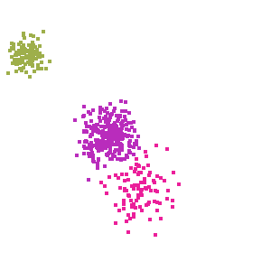

Clustering
#######################

Example of how to cluster a set of points.  The points are randomly drawn from three different distributions.  The clustering algorithm will attempt to dermine which points belong to the same set.  

   Output from example. Each cluster has its own color and each point is colorized to show the cluster it belongs to.

`ExampleClustering.java <https://github.com/lessthanoptimal/ddogleg/blob/v0.15/examples/src/org/ddogleg/example/ExampleClustering.java>`_

.. literalinclude:: ../../examples/src/org/ddogleg/example/ExampleClustering.java
   :language: java
   :linenos:
   :start-after: public class
   :tab-width: 4
   :dedent: 4
